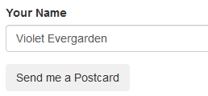
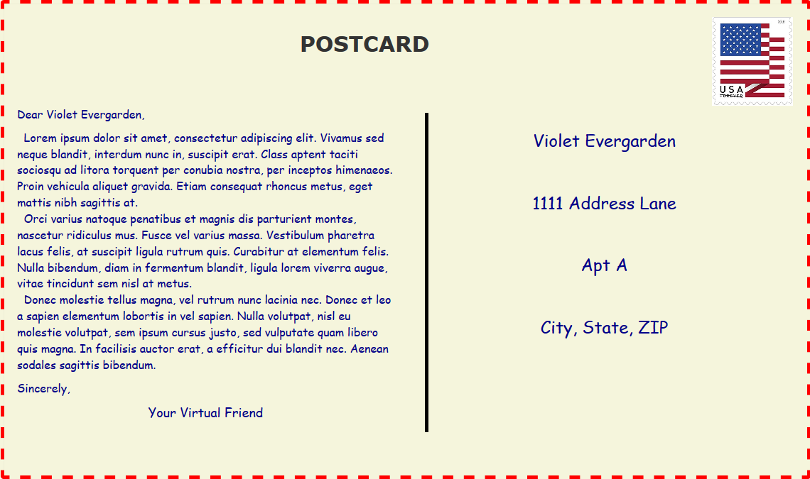

# _Virtual Postcard_

#### _Exercise in Javascript forms and CSS styling, 01.15.2020_

#### By _**Tiffany Siu**_

## Description

This program is an exercise of input forms and styling with CSS.  It takes a name inputted by the user and then returns a realistic postcard addressed to that name.  Lorem ipsum was used for the text of the letter and CSS and bootstrap was used to make it look like an actual virtual postcard.

## Setup/Installation Requirements

### Requirements to Run
* _Web Browser_

### Other Resources Used
* _JQuery_
* _Bootstrap_

### Instructions
_This page may be viewed by cloning the [repository](https://github.com/TSiu88/virtual-postcard.git) from my [GitHub page](https://github.com/TSiu88) and opening the **index.html** file in any web browser._

## Technologies Used

* _HTML_
* _CSS_
* _Javascript_
* _JQuery_
* _Bootstrap_
* _Markdown_

## Notable Features
_This program has a virtual postcard that is styled to appear as a realistic postcard with an address section, line, and stamp.  The line was drawn using CSS with a "::before" selector, which was something new to me._

## Specifications

* _Take user input from field as the user name and saves it_
  * _Example Input: "Violet"_
  * _Example Output: input from field = "Violet"_
* _The program returns a virtual postcard addressed to the name provided_
  * _Example Input: "Violet"_
  * _Example Output: "Dear Violet, ... To Violet, 111 Address Lane, Apt A, City, State, Zip"_
* _Send button is disabled after postcard is received._
  * _Example Input: try to click "Send" button_
  * _Example Output: no new postcard created_

## Screenshots

_Here is a snippet of what the input looks like:_

_Here is a preview of what the output looks like:_

## Known Bugs

_There are currently no known bugs in this program_

## Support and contact details

_If there are any question or concerns please contact me at my [email](mailto:tsiu88@gmail.com). Thank you._

### License

*This software is licensed under the MIT license*

Copyright (c) 2020 **_Tiffany Siu_**
